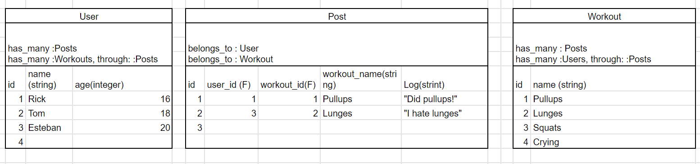

# FitConnect

## Description

FitConnect is a fitness logger and social media website where users can post their thoughts about workouts stored in the app and create workouts for others to share their thoughts.

## CRUD

- Create new workouts and new posts for workouts
- Display list of workouts and posts from database
- Edit posts and workouts in database
- Delete posts and workouts from database

## Wireframe

## Domain Model

## Many-To-Many

- User has many workouts through posts
- Workout has many users through posts
- Post belongs to a workout and a user

## Validations

- A user must be 16 years or older
- Username must exist
- Username must be unique
- A post has a workout and a user
- Workout has a name
